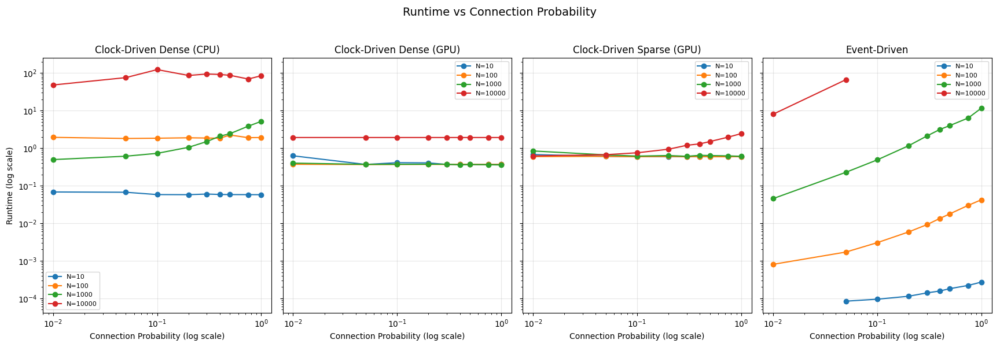

# SNN Scaling

## Problem Statement

How do crossover points between SNN execution strategies (clock-driven, event-driven) vary across hardware platforms, (CPU/GPU/neuromorphic) and how do these crossover points shift depending on whether we optimize for runtime, memory, or energy efficiency? Furthermore, can these crossover points predict the performance of SNN simulators based on their underlying computational strategies (dense matmul, sparse matmul, event queues)?

## Motivation

There is currently little principled understanding of how spiking neural network (SNN) performance emerges from underlying computational primitives across different execution strategies and hardware platforms. As a result, practitioners often lack guidance when choosing between event-driven and time-driven simulators, especially under varying workload characteristics such as sparsity, network size, and temporal structure.

Moreover, existing SNN simulators are typically evaluated as black boxes, without clearly relating system performance to the primitives used to schedule and propagate spikes over time. This makes it difficult to reason about performance bottlenecks or design targeted optimizations.

The goal of this work is to bridge this gap by explicitly connecting computational primitives to system-level performance. This would enable more informed simulator selection and inform execution strategies that dynamically choose or switch primitives based on workload characteristics. In particular, this framework can help identify regions of the parameter space where neuromorphic hardware offers clear performance or efficiency advantages over conventional CPU/GPU-based execution.

## Status

Most simulations running without errors and produce equivalent spike statistics for the same parameter values. 

Spinnaker simulation is implemented but has not been configured or tested with an actual board.

OpenMP simulation and Loihi simulation are not yet implemented.

TODO:
- Implement OpenMP simulation
- Implement baseline simulations with randomly generated scheduled
- Implement Loihi simulation
- Find relevant SNN simulators and create simulation runners for them
- Look into Loihi/Spinnaker board access
- Implement energy monitoring with intel rapl and nvidia-smi (and find neuromorphic monitoring solutions)
- Run full parameter sweeps for each simulation across number of neurons, connection probability, delay structure, timestep size, spike_statistics, etc.

Basic parameter sweep recording runtime is shown below (RTX 4070S Ti and Xeon E5-2696 v4)



## Setup

Assumes `pyenv` is installed and correctly using version from `.python-version`.

```shell
python -m venv venv
source venv/bin/activate
pip install -r requirements.txt
```

Before running `python -m simulations.run_all`, the event-driven C++ backend will need to be compiled with:

```shell
python setup.py build_ext --inplace   
```